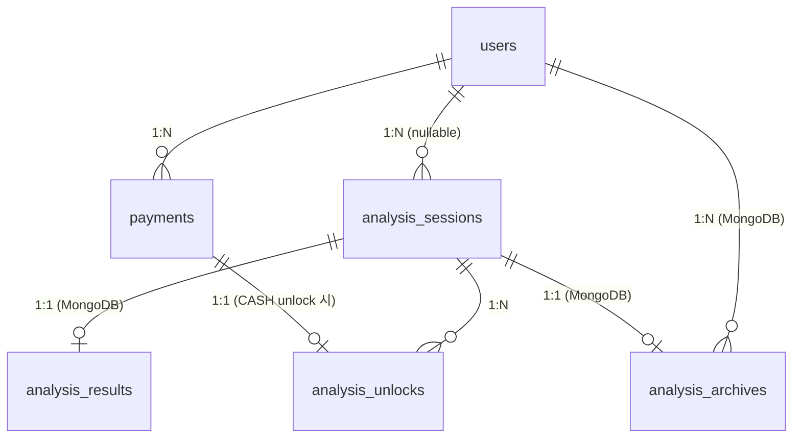

# Database Schema

> 작성일: 2026-06-07
> PostgreSQL 16 (정형 데이터) + MongoDB 7 (비정형 데이터)

---

## ERD



---

## PostgreSQL

### users

> 인증 방식 미확정 — 최소 스펙 유지. 확정 후 컬럼 추가.

| 컬럼 | 타입 | 제약 | 설명 |
|---|---|---|---|
| id | BIGINT | PK, AUTO_INCREMENT | |
| created_at | TIMESTAMP | NOT NULL | |
| updated_at | TIMESTAMP | NOT NULL | |

---

### analysis_sessions

> 분석 1건의 입력 정보. 원문 대화는 저장하지 않는다.

| 컬럼 | 타입 | 제약 | 설명 |
|---|---|---|---|
| id | BIGINT | PK, AUTO_INCREMENT | |
| user_id | BIGINT | FK → users.id, NULL 허용 | 비로그인 분석 허용 여부 확정 전 nullable |
| relationship_type | VARCHAR | NOT NULL | CRUSH / LOVER / EX / UNREQUITED / FRIEND / WORKPLACE |
| context_memo | TEXT | NULL 허용 | 사용자 맥락 메모 (옵셔널) |
| input_type | VARCHAR | NOT NULL | IMAGE / TEXT |
| created_at | TIMESTAMP | NOT NULL | |

**연관관계**
- `users` ← N:1 (nullable)
- `analysis_unlocks` → 1:N

---

### payments

> 포트원 결제 기록. 광고 unlock은 결제가 없으므로 이 테이블에 row 없음.

| 컬럼 | 타입 | 제약 | 설명 |
|---|---|---|---|
| id | BIGINT | PK, AUTO_INCREMENT | |
| user_id | BIGINT | FK → users.id, NOT NULL | |
| portone_payment_id | VARCHAR | NOT NULL, UNIQUE | 포트원 결제 고유 ID |
| amount | INT | NOT NULL | 결제 금액 (원) |
| status | VARCHAR | NOT NULL | PENDING / PAID / FAILED / CANCELLED |
| created_at | TIMESTAMP | NOT NULL | |
| paid_at | TIMESTAMP | NULL 허용 | 결제 완료 시각 |

**연관관계**
- `users` ← N:1
- `analysis_unlocks` → 1:1 (CASH unlock에서만 참조)

---

### analysis_unlocks

> 분석 세션별 등급 unlock 상태. 같은 세션에서 같은 등급은 중복 unlock 불가.

| 컬럼 | 타입 | 제약 | 설명 |
|---|---|---|---|
| id | BIGINT | PK, AUTO_INCREMENT | |
| session_id | BIGINT | FK → analysis_sessions.id, NOT NULL | |
| grade | VARCHAR | NOT NULL | BASIC / DEEP_SCAN / NEXT_MOVE |
| method | VARCHAR | NOT NULL | AD / CASH |
| payment_id | BIGINT | FK → payments.id, NULL 허용 | AD unlock 시 null |
| unlocked_at | TIMESTAMP | NOT NULL | |

**유니크 제약**: `(session_id, grade)` — 동일 세션에서 같은 등급 중복 unlock 방지

**연관관계**
- `analysis_sessions` ← N:1
- `payments` ← N:1 (CASH unlock 시에만)

---

## MongoDB

### analysis_results

> 심리 엔진(system_v2) 응답을 필드 매핑해 저장. 티어에 따라 블록 존재 여부가 달라짐.

```
analysis_results
├── _id            : ObjectId
├── sessionId      : Long           ← analysis_sessions.id 참조
├── tier           : String         "basic" | "deep" | "next_move"
├── relationType   : String         "썸" | "연인" | "전연인" | "짝사랑" | "친구" | "직장"
├── crisisDetected : Boolean
│
├── basic (항상 존재)
│   ├── headline           : String
│   ├── keySignal
│   │   ├── label          : String   signal_id (reply_speed_change 등)
│   │   ├── observation    : String
│   │   └── interpretation : String
│   ├── supportingSignals[]           최소 2개, 최대 4개
│   │   ├── label          : String
│   │   ├── observation    : String
│   │   └── interpretation : String
│   ├── frameworkSummary   : String
│   ├── overallAssessment  : String
│   ├── teaserHiddenIntent : String
│   ├── teaserNextMove     : String
│   └── trendVsLast        : String   재분석 시에만 존재
│
├── deep (tier = deep or next_move 시 존재, 그 외 null)
│   ├── signalDetail[]
│   │   ├── signalId               : String
│   │   ├── strength               : String   "강함" | "중간" | "약함"
│   │   ├── confidence             : String   "높음" | "중간" | "낮음"
│   │   ├── evidenceCount          : Int
│   │   ├── rawEvidence[]          : String[]
│   │   ├── allowedInterpretation  : String
│   │   └── forbiddenCheck         : String
│   ├── frameworkDetail
│   │   ├── primary        : String
│   │   ├── primaryResult  : String
│   │   ├── secondary      : String   nullable
│   │   └── secondaryResult: String   nullable
│   ├── riskSignals[]
│   │   ├── type           : String   "Gottman_비난" | "가스라이팅" | "조종" 등
│   │   ├── detected       : Boolean
│   │   ├── confidence     : String
│   │   └── basis          : String
│   └── calibrationFlags[] : String[]
│
├── nextMove (tier = next_move 시 존재, 그 외 null)
│   ├── situationRead        : String
│   ├── recommendedReplies[]
│   │   ├── style            : String   "직구형" | "부드럽게" | "유머형"
│   │   └── message          : String
│   ├── eventStrategy        : String
│   ├── expectedResponse     : String
│   └── mbtiToneNote         : String   MBTI 입력 시에만 존재
│
├── funComment (MBTI or 사주 입력 시에만 존재)
│   ├── label   : String
│   └── content : String
│
├── disclaimer : String
└── createdAt  : ISODate
```

**참조**: `sessionId` → `analysis_sessions.id` (외래키 강제 없음, 애플리케이션 레벨 보장)

---

### analysis_archives

> 사용자가 저장 선택한 분석 요약본. 원문·대화 내용은 저장하지 않는다.
> RAG 전 단계 — 인물별 묶어보기 + 직전 결과 라이트 비교 용도.

```
analysis_archives
├── _id              : ObjectId
├── userId           : Long      ← users.id 참조 (인덱스)
├── sessionId        : Long      ← analysis_sessions.id 참조
├── personAlias      : String    상대 별명 (사용자 입력)
├── relationType     : String
├── summary          : String    overallAssessment 요약
├── headline         : String    basic.headline
├── keySignalLabels[]: String[]  핵심 시그널 ID 목록
├── riskFlags[]      : String[]  감지된 위험 신호 타입 목록
└── savedAt          : ISODate
```

**인덱스**: `userId` (인물별·사용자별 조회 최적화)

---

## 연관관계 요약

| 관계 | 설명 |
|---|---|
| `users` → `analysis_sessions` | 1:N, user_id nullable (비로그인 분석 허용 여부 미확정) |
| `users` → `payments` | 1:N |
| `analysis_sessions` → `analysis_unlocks` | 1:N, (session_id, grade) unique |
| `payments` → `analysis_unlocks` | 1:1, CASH unlock 시에만 연결 |
| `analysis_sessions` → `analysis_results` | 1:1, MongoDB 참조 (sessionId) |
| `users` → `analysis_archives` | 1:N, MongoDB 참조 (userId) |
| `analysis_sessions` → `analysis_archives` | 1:1, MongoDB 참조 (sessionId) |
